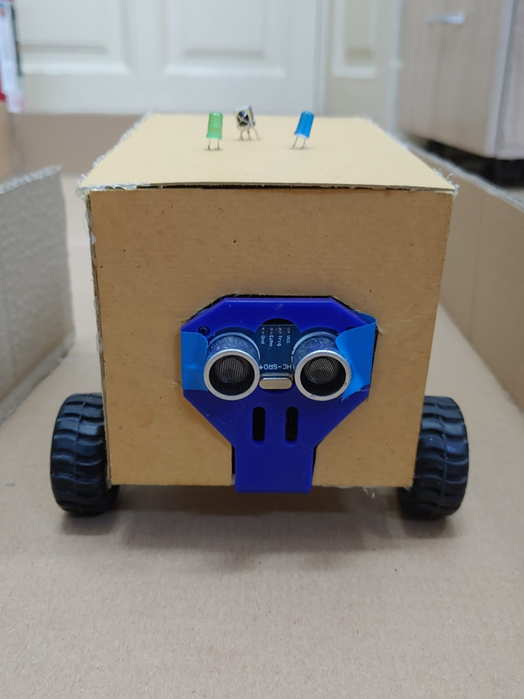
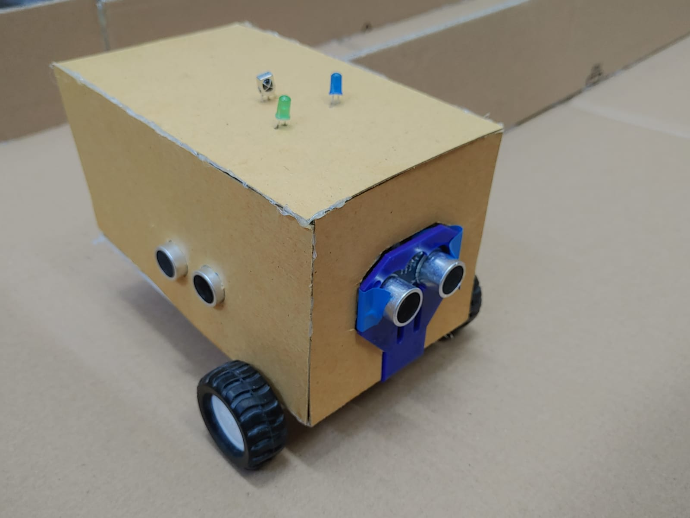
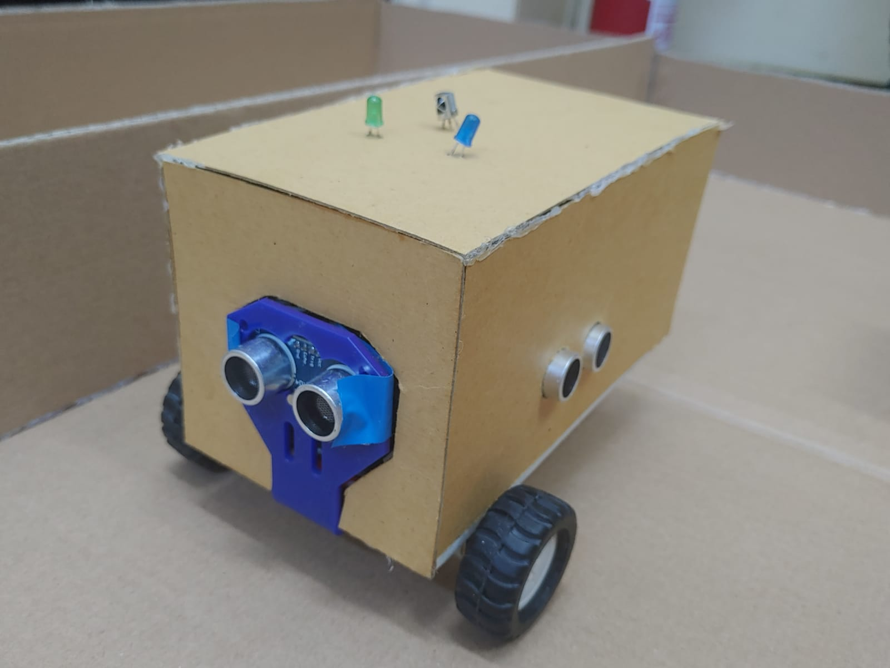
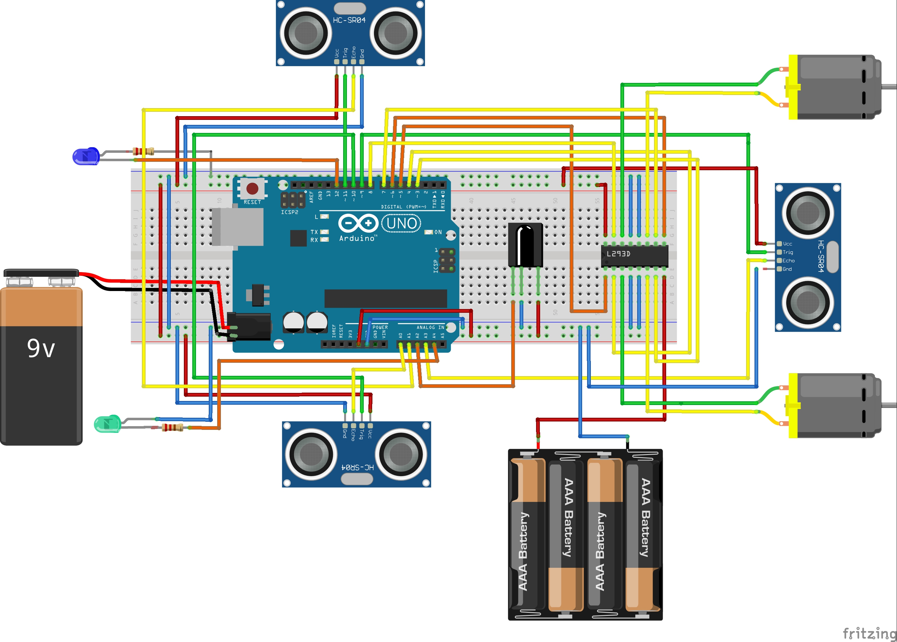
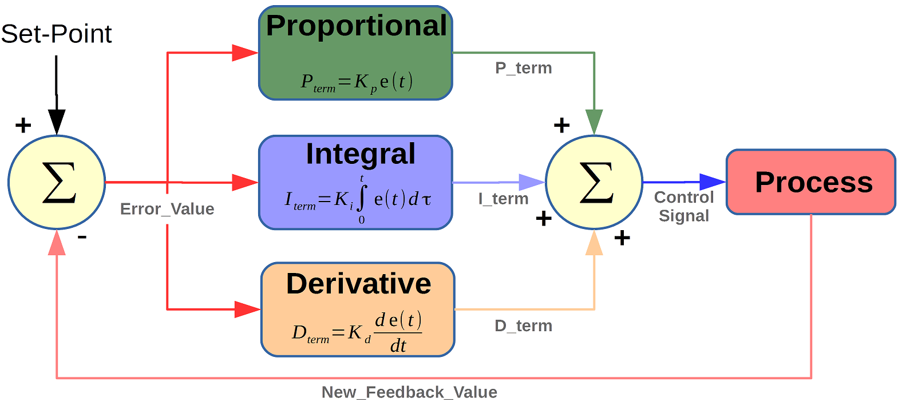

# Maze solver

Maze solver robot that must find its way through a labyrinth. The algorithm monitoring the wall is one of the most popular algorithms for finding a way out of the maze, and is also known as the "Rule of the right hand". If the maze of connections, or if all its walls are connected to each other, then if the robot is inside the maze, backing to one side of the wall during the entire passage through the maze, there is a guaranteed way out of the maze, otherwise the robot would be returned to the entrance of the labyrinth and thereby make the rounds of each path in the maze at least once. The task is to go through the entire robot labyrinth and successfully complete it.

### Hardware / BOM ###
 

1. Arduino Uno
1. 2x Breadboard
1. Wires
1. 20cm x 15cm plastic board (the support of the car)
1. 3x 9cm x 20cm cardboard (left,right and top walls of the car)
1. 2x 9cm x 15cm cardboare (front and back walls of the car)
1. 2x DC motor
1. IR receiver
1. L293D driver
1. 3x Ultrasonic sensor (HC-SR04)
1. 2x Resistor (220 ohm)
1. 2x Led (green and blue)
1. 2x Wheel
1. Caster Wheel
1. 4x AAA Battery Holder
1. 4x AAA battery
1. 9V battery

[Click here for the BOM link](https://docs.google.com/spreadsheets/d/1Htry010sDG5Vxl1XxuDkIDsEU6a6pIBbHVVmY9l-o_E/edit#gid=253948986)

 

## Photo of the entire project ##

 

## Schematics for the car ##

 

 

**Demo video**
[click here for the demo video](https://)

 

## Instructions / features ##

### Turn on / off ###

The motors of the car are turned on/off by the IR remote. To power it, you need to press the **>>|** button, and to stop it, the **>|** button. Once the motors are powered up, the car started to move. 

### Moving through the maze ###

Once the car is turned on, there are 3 main cases in which the car behaves:
 
1. There is a new path on the right side of the car. Then, no matter if the car could still go forward or on the left, it chooses to make a 90° rotation to the right and continues to go forward until a new case is met.
1. There is a new path on the left. Here, there are another 2 cases:
   1. The car can still go forward. Then, it chooses to go forward
   1. The car can't go forward. Basically, the only possible way it to make a 90° rotation to the left.
1. The car is blocked (can't go to the left, right or front). In this case, it makes a 180° rotation and starts to go forward.

### Ultrasonic sensors ###

To establish the position of the car in the maze(how much space is on the left, right, or in front of it), we used 3 ultrasonic sensors to measure the distance. We then calculate the distance, using the speed of the sound and the time measured by the sensor. 

### PID control ###

When the car is moving forward, to ensure that is going straight, or if it is too close to one of the walls, to redress it so as the distances between the car and the two walls are almost equal, we used the **PID control**. PID (proportional integral derivative) controllers use a control loop feedback mechanism to control process variables as close to the target or setpoint output as possible. 

### Turning left / right ###

When the car decides to make a 90° rotation, the corresponding led will blink. When the car makes a left-turn, then the green one blinks, otherwise, the blue one blinks.
